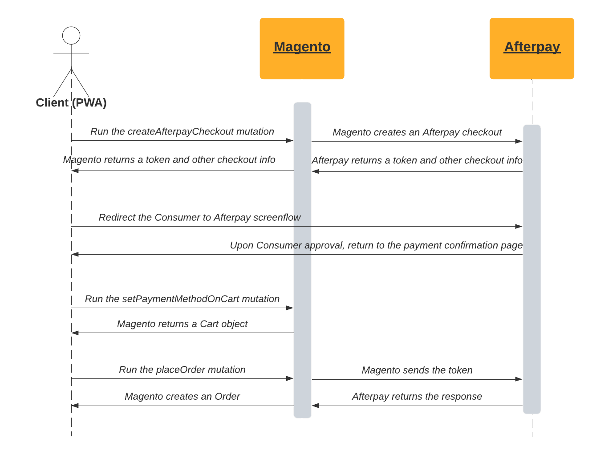

# Afterpay GraphQL support

The Afterpay module provides the possibility to retrieve an Afterpay checkout token and use Afterpay payment method via GraphQL.

## Afterpay workflow

The following diagram shows the workflow for placing an order when Afterpay is the selected payment method.


## Usage

Please refer to the [Magento GraphQl checkout tutorial](https://devdocs.magento.com/guides/v2.4/graphql/tutorials/checkout/index.html) for the general approach.

To be able to pay via Afterpay in your frontend, you are required to create an Afterpay checkout. This needs to happen *after* you set all required cart data, but *before* you want to set payment method for cart.

The mutation to create an Afterpay checkout looks like this:

```
mutation {
    createAfterpayCheckout(input: {
        cart_id: "{ CART_ID }"
        redirect_path: {
            cancel_path: "frontend/cancel/path"
            confirm_path: "frontend/confirm/path"
        }
    }) {
        afterpay_token
        afterpay_expires
        afterpay_redirectCheckoutUrl
    }
}
```

The input is masked cart id (for guest user) or quote id (for logged-in user) and urls to return when Consumer completes the Afterpay screenflow. The successful output will look like this:

```
{
    "data": {
        "createAfterpayCheckout": {
            "afterpay_token": "{ AFTERPAY_TOKEN }",
            "afterpay_expires": "2021-08-03T15:44:28.728Z",
            "afterpay_redirectCheckoutUrl": "https://portal.sandbox.afterpay.com/us/checkout/?token={ AFTERPAY_TOKEN }"
        }
    }
}
```

Retrieved data will be needed for two things (can be done in any sequence):
1. The `afterpay_token` must be used when you are setting the payment method on the cart. Hence, the mutation **setPaymentMethodOnCart** should look like this:
```
mutation {
  setPaymentMethodOnCart(input: {
      cart_id: "{ CART_ID }"
      payment_method: {
          code: "afterpay"
          afterpay: {
            afterpay_token: "{ AFTERPAY_TOKEN }"
          }
      }
  }) {
    cart {
      selected_payment_method {
        code
      }
    }
  }
}
```
2. The Consumer must go through the Afterpay screenflow by `afterpay_redirectCheckoutUrl` *before* order placement operation
    - If the Consumer clicks "confirm", they will be returned to the Merchant website (to `confirm_url` which was passed in `createAfterpayCheckout` mutation) with the orderToken and a status of "SUCCESS".
    - If the Consumer cancels, they will be returned to the Merchant website (to `cancel_url` which was passed in `createAfterpayCheckout` mutation) with the orderToken and a status of "CANCELLED".

## Error handling

Any errors on the Afterpay side will be exposed in the response, eg:

```
{
  "errors": [
    {
      "message": "Unable to place order: Transaction has been declined. Please try again later."
    }
  ]
}
```

Any Magento errors will also appear in the same manner, eg:

```
{
  "errors": [
    {
      "message": "Could not find a cart with ID { CART_ID }"
    }
  ]
}
```
